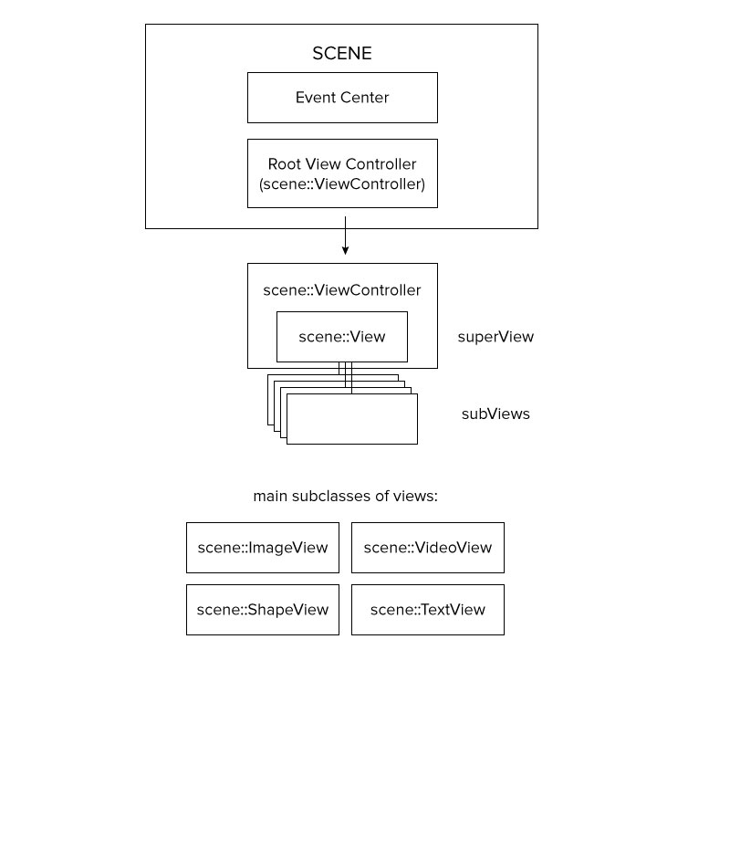

**po::scene** is [Potion's](http://www.potiondesign.com) 2D [Scene Graph](#scenegraph) block for working with layout, animation and interaction of multiple objects and views within [Cinder](http://libcinder.org). It is at its most useful when used with applications that contain a large amount of interactive objects with various states and attributes. po::scene is released under the [BSD New License](./LICENSE).

## Using this Repo
When pulling down the repo, `develop` is the latest dev branch tested working with Cinder v0.9.1, `master` is stable. If you're looking for older versions please checkout the appropriate tags - if you're on an old project with Cinder 0.8.6, you can checkout the `v0.8.6` tag.

If you have cpp files with the same name as any of the po::scene cpp files, it might compile but fails to link. Building po::scene as a library could prevent this. 

## About
The main philosophy behind po::scene is to avoid replacing any of the built-in Cinder functionality at all costs and keep the library as simple as possible.

Some of the key features include:

+ Draw tree with automatic update and draw functionality
+ Per-view attributes for position, rotation, scale, offset, color, alpha, etc.
+ Cinder timeline animation attributes that automatically update view attributes
+ Per-view origin points with support for dynamic alignment
+ Point-transform from screen space to anywhere in the scene
+ View or group-based Masking
+ Full integration with Cinder::Shape2d for custom interactive shapes and texture mapping
+ View Controllers for leveled grouping of views, allowing for group manipulation and hit-testing
+ Signal based events with type, source reference and propagation properties
+ Simple wrappers for Cinder's built-in Shapes, Textures, TextBoxes, Videos
+ Rendering to FBO/Texture for post-processing or caching
+ Smart-pointer based syntax with TypeDefs for built-in classes
+ Simple inheritance for custom views: just define update(),draw() and getBounds()

## What is a Scene Graph

[Wikipedia](http://en.wikipedia.org/wiki/Scene_graph) is probably the best place for a definition that is far more succinct than we can offer.

> A scene graph is a collection of views in a graph or tree structure. A tree view (in the overall tree structure of the scene graph) may have many subviews but often only a single parent, with the effect of a parent applied to all its sub views; an operation performed on a group automatically propagates its effect to all of its members. In many programs, associating a geometrical transformation matrix (see also transformation and matrix) at each group level and concatenating such matrices together is an efficient and natural way to process such operations. A common feature, for instance, is the ability to group related shapes/objects into a compound object that can then be moved, transformed, selected, etc. as easily as a single object.
 
## Structure

Using a tree metaphor, **po::scene** contains three main classes:

+ `po::scene::Scene` is the root system of the tree. It contains the trunk of the tree ( the root ViewController ), which in turn contains all branches and leaves.
+ `po::scene::ViewController` represents a branch. It can contain any number of other branches, as well as leaves. a ViewController will always contains a view, to which leaves may be added.
+ `po::Scene::View` represents a leaf, or an end point in the scene-graph. These Views are usually the point for any gl drawing.

 

*Diagram of po::Scene structure*

Moving any branch of a tree will also move all of its connected branches and leaves. In po::scene moving, scaling, rotating or manipulating a `po::scene::View ` will transform all of the subViews within it.

*Screenshot from the bounds example, describing the structure of a scene* 
## Views

Views are the basic building blocks of a scene. The po::scene::View class is a base class that can not be used on its own, but is instead extended by a variety of inheriting classes that make up po::scene.
		
### Attributes
Views have a number of built in attributes that relate to how they appear in the scene:

+ `position` The coordinate of the View's origin within it's parent or the scene. This is where 0,0 will be within the view's own coordinate space.
+ `rotation` The rotation of the View along the z-axis (2d rotation). Expressed in degrees.
+ `scale` The x and y scale of the View.
+ `fillColor` The color that is used for drawing the View. This color is used differently depending on the type of drawing the View does. Expressed as a ci::Color.
+ `alpha` The transparency of the View. This is applied through the view tree. For example, if a parent View has an alpha of 0.5 and the subView has an alpha of 1.0, the subView will draw at 0.5 alpha. Items with an alpha of 0.0 will not render but they will be considered for events.
+ `offset` The offset, relative to the View's (0,0) origin, at which the View's content will be drawn.
+ `alignment` Built-in enums used to set the View's offset automatically, relative to its bounds. For example, CENTER_CENTER will set the View's offset to `getBounds().getSize() * - 0.5`.

These attributes use setters and getters that allow the View to internally keep track of things.
	
	using namespace po::scene;
	SomeViewClassRef view = SomeViewClass::create();
	view->setPosition(ci::vec2(25.0f, 25.0f)
	view->setFillColor(ci::Color(1.0f, 0.0f, 0.0f);
	view->setAlpha(0.5f);
	view->setRotation(45.0f);
	view->setAlignment(Alignment::CENTER_CENTER);
	
### Chaining
All View attributes should return by reference, allowing for easy chaining when setting several parameters at once. Here is a more convenient way to write the above example:
	
	using namespace po::scene;
	SomeViewClassRef view = SomeViewClass::create();
	view->setPosition(ci::vec2(25.0f, 25.0f)
	.setFillColor(ci::Color(1.0f, 0.0f, 0.0f)
	.setAlpha(0.5f)
	.setRotation(45.0f)
	.setAlignment(Alignment::CENTER_CENTER);

	

### Animations
All View attributes have corresponding ci::Anim objects. These animations can be set and they will be automatically applied to the View's internal attributes. 

	// Animate a view from 0,0 to 50,50
	ci::app::timeline().apply(&view->getPositionAnim(), ci::vec2(50.0f, 50.0f), 1.0f);
	
Setting any View attributes at any time during an animation will cancel the animation for that attribute.

	//Stop animation and retain current position
	view->setPosition(view->getPosition());

### Transformations
Every `po::scene::View` has its own coordinate space. All `po::scene::View` members contain functions for translating back and forth between various coordinate spaces. There are three main spaces:

+ `window` The origin of the application's window, as used by Cinder for all screen-based events.
+ `scene` The origin and transformation of a View's Scene (as specified by the Scene's root View Controller).
+ `local` The origin and transformation of the View.

There are several View functions that can be used to translate between coordinate spaces:

+ `windowToLocal`/`localToWindow` Translate from/to window space.
+ `sceneToLocal`/`localToScene` Translate from/to scene space.
+ `viewToLocal`/`localToView` Translate from one View's space into another View's space. Equivalent to `view1->windowToLocal(view2->localToWindow(...))`.

### Events
All Views can respond to mouse and touch interaction events. These events come through as `po::scene::MouseEvent` and `po::scene::TouchEvent` class members. 

These events inherit from `po::scene::Event`, which in turn wraps Cinder's built-in `ci::app::Event` events while adding po::scene specific information.

All `po::scene` Events have the following information:

+ `ciEvent` A copy of the raw Cinder Event that this Event wraps.
+ `source` The View that is subscribing to the Event.
+ `propagationEnabled` Controls whether or not this Event should continue through the draw tree if it is handled by the source View.
+ `windowPos` The position of the Event in the window space.
+ `scenePos` The position of the Event in the source View's Scene.
+ `localPos` The position of the Event within the source View.

##### Cinder Events
`po::scene` wraps the following built-in global (window) Cinder Events for convenience and consistency:

+ Mouse Down, Mouse Move, Mouse Drag, Mouse Up
+ Touch Began, Touch Moved, Touch Ended. *Note: Cinder responds with a group of TouchEvents, po::scene responds with individual TouchEvents*

These Events will fire on all subscribing Views, in the order of the draw tree (bottom-up), regardless of the Views's bounds.

##### View Events
`po::scene` adds additional Events that add interactivity to all Views. These Events are fired on the top-most View first, and will only pass through Views if the `propagationEnabled` variable is set to `true`.

+ Mouse Down Inside, Mouse Move Inside, Mouse Drag Inside, Mouse Up Inside
+ Touch Began Inside, Touch Moved Inside, Touch Ended Inside

#### Subscribing to events
`po::scene::View` Events are signal-based, and can be retrieved using the `getSignal(SignalType)` syntax:
	
	using namespace po::scene;
	SomeViewClassRef View = SomeViewClass::create();
	// Connect View's Mouse Down Inside event to a member function of this class
	View->getSignal(MouseEvent::Type::DOWN_INSIDE).connect(std::bind(&ThisClass::mouseHandler, this, std::placeholders::_1);
	
	
### Visibility/Interaction
`po::scene::View` contains two variables that affect interactivity. The `setVisible(bool enabled)` method allows the View to stay in the View hierarchy, but it will not render and it will not be considered in interaction events. It is a quick way to turn a View on/off without having to add and remove it. 

`setInteractionEnabled(bool enabled)` sets a View to be ignored for events, but still render to the screen.

On the other hand, to set a View to be considered for interactive events but not render to the screen (e.g., to create an invisible hit area), set the View's `alpha` to 0.

## ViewControllers

ViewControllers are designed to control and contain subviews.
they can contain any number of Views or other ViewControllers. These are the branches of the scene, and they allow for hierarchy, grouping, and complex layouts. 

A ViewController contains main View, to which subviews can be added.
The ViewController is set up upon loading it's main view - ViewController::viewDidLoad();

Here are some of the virtual functions that construct a ViewController
`

	virtual void loadView()  
	virtual void viewDidLoad()  
	virtual void viewWillAppear()  
	virtual void viewWillLayoutSubviews()  
	virtual void viewDidLayoutSubviews()  
`

## Scene

The `po::scene::Scene` class represents the main entry point for a scene graph. Any program can contain multiple scene graphs, which will exist entirely independent of each other.

The Scene class requires a root View, which inherits from `po::scene::ViewController`. This View represents the beginning of the draw tree, and is the origin for the scene.

To create a Scene, you can either start with an empty (auto-created) root View

	using namespace po::scene;
	SceneRef myScene = Scene::create();
	
You could then add subViews to this root View using the `getRootViewController()->getView()` function of `po::scene::ViewController`.
	
	ViewRef myRootView = MyRootViewClass::create();
	myScene->getRootViewController()->getView()->addSubView(myRootView);
	
 or (more common) extend `po::scene::ViewController` and provide that as the root ViewController.
 
	using namespace po::scene;
	SceneRef myScene = Scene::create(MyRootViewControllerClass::create());

The Scene's `update()` and `draw()` functions need to be called each frame from Cinder's `update()` and `draw()` functions.

	void MyCinderApp::update()
	{
		myScene->update();
	}
	
	void MyCinderApp::draw()
	{
		myScene->draw();
	}
	

This in turn will traverse the View tree, automatically triggering the `update()` and `draw()` trees of every visible View in the scene.

## Cinder Views

po::scene provides a number of convenient wrappers around Cinder classes that allow users to attach various renderable objects rather than trying to extend these or re-implement these classes. These allow renderable Cinder objects to gain hit-testing, matrix transforms, animations, and everything else provided by the `po::scene::View` class.

### po::scene::ImageView

`po::scene::ImageView` provides a simple View that displays a `ci::gl::TextureRef`.

### po::scene::ShapeView

`po::scene::ShapeView` is a more complex wrapper for both the `ci::Shape2d` class as well as the `ci::gl::TextureRef` class. 

The first way to use a `po::scene::ShapeView` is as a solid-filled shape. `po::scene::ShapeView` provides number of convenience methods for this purpose:

	using namespace po::scene;
	ShapeViewRef myRect = ShapeView::createRect(100,200);
	ShapeViewRef mySquare = ShapeView::createSquare(100);
	ShapeViewRef myEllipse = ShapeView::createEllipse(100,200);
	ShapeViewRef myCircle = ShapeView::createCircle(100);
	

 
*Examples of the above shapes drawn on a 300x300 app window* 

These create and set the backing `ci::Shape2d`. This can be replaced at any time by the user.

This shape will be drawn using the `po::scene::View` fillColor attribute, and hit-testing will be done using the built in `ci::Shape2d` contains method.

In addition, a `ci::gl::TextureRef` can be attached to it to any `po::scene::ShapeView` and mapped using a number of alignments.

 
*Texture drawn on an ellipse; see the ShapeTextureSample for changes in alignment and additional shapes* 

### po::scene::VideoView 
Related samples only tested working on Mac, and on Windows with [Quicktime 7](https://support.apple.com/downloads/quicktime-windows) installed.   

*Quicktime has deprecated on Windows.*   
*For playing video on Windows, there are many other options available, such as: [Cinder-WMFVideo](https://github.com/Potion/Cinder-WMFVideo).*

`po::scene::Video` provides a View that wraps a Cinder movie player. Because there are numerous Cinder video players, it was created as a generic wrapper. It provides a `po::scene::VideoView` type, which uses the Cinder Quicktime player. You can access or change the Cinder movie and texture reference by calling `setMovieRef` and `getMovieRef`.

	po::scene::VideoViewRef poVideo = po::scene::VideoView::create();
	 
	//	create the Cinder movie reference
	ci::fs::path moviePath = ci::app::getAssetPath("path_to_movie");
	ci::qtime::MovieGlRef movieRef = ci::qtime::MovieGl::create(moviePath);
	
	//	access the Cinder movie reference from VideoGL View
	poVideo->setMovieRef(movieRef);
	poVideo->getMovieRef()->play();
	

### po::scene::TextView

`po::scene::TextBox` wraps the `ci::TextView` class.

You can create a `po::scene::TextView` with an preexisting `ci::TextBox`; alternatively, `po::scene::TextView::create()` will return a `po::scene:: TextView` wrapping a newly created `ci::TextBox`.

To set the `ci::TextBox` member of the `po::scene::TextView`, call the `setCiTextBox` method. This automatically renders the Cinder TextBox and creates a new texture reference.

The bounds of a `po::scene::TextView` View are the bounds of that texture or, if no texture has been created, `getBounds()` returns a new `ci::Rectf`.

To manipulate the underlying `ci::TextBox`, call `getCiTextBoxCopy()`.

## Custom Views
Custom Views should be made for anything that needs to draw into the scene graph and be considered for hit-testing/interaction.

To create a View, extend this class and implement the following methods:

+ `update()` Called every frame, do any general code updates here before drawing.
+ `draw()` This draws the View. Override this method and do any OpenGL drawing here. When this method is called all transforms have been applied to the View (i.e. position, scale, rotation), so everything is relative to the View's (0,0) origin.
+ `getBounds()` This is necessary for any hit-testing of an object. Return a ci::Rectf with the Top Left and Bottom Right of the content drawn (or a wider area if you'd like to expand the hit area). For example, the po::scene::Image class returns the top left as 0,0 (relative to the View's origin) and the width and height of the associated `ci::gl::TextureRef`.

		ci::Rectf Image::getBounds()
		{
			return ci::Rectf(0,0,mTexture->getWidth(),mTexture->getHeight());
		}
		

Custom ViewControllers are often convenient but does not have a draw method, that is handled by the contained view, often methods to override would be `update()` and `viewDidLoad()`.

## History

[Potion](http://www.potiondesign.com) is an interactive design and development studio based in New York City. [Potion](http://www.potiondesign.com) was founded in 2005 with the idea of bringing interaction beyond the desktop and into the real world. At the time the tools for doing this type of work were few and far between, and most of our work involved writing many things from scratch. Examples include Vision Systems, custom touchscreens, and numerous OpenGL implementations.

As Potion began to grow, our OpenGL work slowly started to evolve into our internal framework [poCode](https://web.archive.org/web/20141221202631/http://www.pocode.org/). We executed many projects and improved [poCode](https://web.archive.org/web/20141221202631/http://www.pocode.org/) over the course of nearly 6 years, but supporting the basic infrastructure for a growing number of platforms, library updates and devices soon became a larger task than we could handle. 

Around 2010 a number of open-source C++ frameworks had began to emerge that covered a lot of the basic functionality (and beyond) of [poCode](https://web.archive.org/web/20141020040513/http://www.pocode.org/), and they also began to amass a large base of users. At the same time, the core feature of [poCode](https://web.archive.org/web/20141221202631/http://www.pocode.org/) that we used for every project was the scene graph, and there did not seem to be a clearly superior implementation of this in any other frameworks.

[Potion](http://www.potiondesign.com) made the decision in 2014 to move to [Cinder](http://libcinder.org/), and at the same time rewrite our scene graph to work on top of all of the great work that the [Cinder](http://libcinder.org/) team had done (and continue to do). Since then we have planned, written, tested, re-planned, and rewritten our scene graph while using it to complete several large-scale interactive installations.

We now feel ready to release po::scene, a 2D scene graph built on top of [Cinder](http://libcinder.org/). It is a tool that we find extremely useful, and we're hoping others do as well. It is not right for every project, but we are hopeful that there are enough people out there doing similar work so that it will help save a few people from rewriting scene graphs from scratch for each project. We would love it if others gave it a try and let us know what they think. We're happy to answer any questions (within reason) and respond to pull requests, address bugs, etc.

At the same time, regardless of the amount of people who decide to use it, this is the library that we will use for the foreseeable future for the majority of our installations, so it will be regularly tested, updated, fixed and improved for our own benefit.

We are happy to have access to the wonderful resource that is Cinder, so hopefully we can pay it forward by open sourcing this library.
